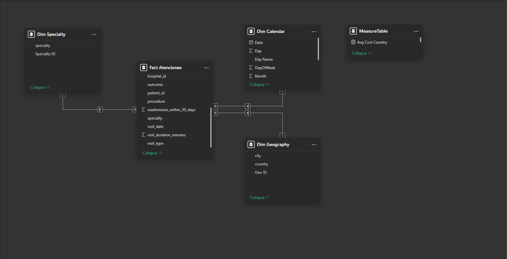
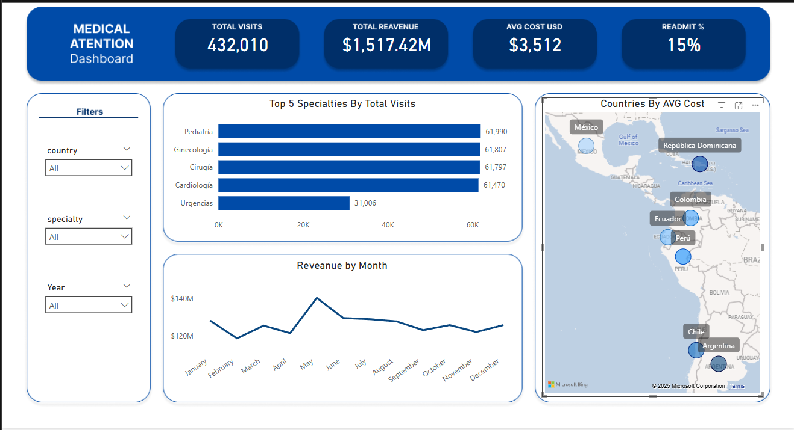

#  Prueba Técnica – Ingeniería de Datos
```markdown
Proyecto demostrativo de ciclo completo de datos sobre **500 000 atenciones médicas**:

1. **EDA + Limpieza** → [`NOTEBOOKS/01_eda_y_limpieza.ipynb`](NOTEBOOKS/01_eda_y_limpieza.ipynb)  
2. **ETL a PostgreSQL** → [`src/etl.py`](src/etl.py)  
3. **Modelo predictivo (readmisión 30 días)** → [`NOTEBOOKS/02_modelo_predictivo.ipynb`](NOTEBOOKS/02_modelo_predictivo.ipynb)  
4. **Descargar Dashboard Power BI** → [`DASHBOARD/DASHBOARD_LINK.md`](DASHBOARD/DASHBOARD_LINK.md)  

---
```
## 📂 Estructura del repositorio

```

├── DATA/                      # < .gitignore >  CSV y Parquet
│   ├── dataset\_salud\_500k.csv
│   └── clean\_dataset.parquet
├── DASHBOARD/
│   ├── DASHBOARD_LINK.md
│   ├── dashboard_overview.png              
│   └── relationships_overview.png
├── NOTEBOOKS/
│   ├── 01\_eda\_y\_limpieza.ipynb
│   └── 02\_modelo\_predictivo.ipynb
├── SRC/
│   ├── **init**.py
│   ├── config.py              # rutas y PG\_URI
│   └── etl.py
├── SQL/
│   └── create_tables.sql
├── requirements.txt
└── README.md                  # ← este archivo

````

---

## ⚙️ Instalación

```bash
# 1. Clonar + venv
git clone https://github.com/tu_usuario/prueba-tecnica-grandalf.git
cd prueba-tecnica-grandalf
python -m venv .venv && source .venv/Scripts/activate   # Windows Git Bash

# 2. Dependencias
pip install -r requirements.txt
````

### PostgreSQL (local)

```bash
# credenciales por defecto (cámbialas o usa variables de entorno)
createuser -s postgres           # si no existe
createdb  postgres               # si no existe
```

> **Variables de entorno** (opcionales, ya hay valores por defecto en `config.py`)
>
> ```
> setx PG_USER  postgres
> setx PG_PASS  1234
> setx PG_DB    prueba
> setx PG_HOST  localhost
> setx PG_PORT  5432
> ```

---

## 🚀 Pipeline

| Paso          | Comando                                            | Resultado                                                                                         |
| ------------- | -------------------------------------------------- | ------------------------------------------------------------------------------------------------- |
| **ETL**       | `python -m src.etl`                                | Carga `clean_dataset.parquet` → **public.atenciones\_medicas** en PostgreSQL.                     |
| **EDA**       | `jupyter lab NOTEBOOKS/01_eda_y_limpieza.ipynb`    | Análisis exploratorio interactivo, limpieza y generación del archivo Parquet limpio.              |
| **Modelo**    | `jupyter lab NOTEBOOKS/02_modelo_predictivo.ipynb` | Entrena `LogisticRegression` (readmisión 30 días) y guarda **models/readmission\_logreg.joblib**. |
| **Dashboard** | Abrir **`DASHBOARD_LINK.md`** y sigue el enlace de descarga | Una página interactiva con filtros (Country, Specialty, Year) y KPIs principales. |

---

## 🧩 Modelo de datos



* **Dim Calendar**: generada en Power BI (`CALENDARAUTO + columnas`), marcada como *Date table*.
* **Dim Geography**: ciudad → país (moda por ciudad) con `Geo ID`.
* **Dim Specialty**: clave incremental y nombre de especialidad.
* **MeasuresTable**: contiene todas las medidas utilizadas en el reporte
---

## 🛠️ Medidas DAX principales

| Medida             | Fórmula resumida                                                 |
| ------------------ | ---------------------------------------------------------------- |
| `Total Visits`     | `COUNTROWS ( Fact Atenciones )`                                  |
| `Total Cost USD`   | `SUM ( Fact Atenciones[cost_usd] )`                              |
| `Avg Cost USD`     | `AVERAGE ( Fact Atenciones[cost_usd] )`                          |
| `Readmit %`        | `DIVIDE ( SUM(readmission_30d), [Total Visits] )`                |

*(ver detalles en el reporte .pbix)*

---

## 📊 Dashboard



| Zona | Visual | Métrica clave |
|------|--------|---------------|
| **KPI Header** | Tarjetas (4) | Total Visits, Total Revenue, Avg Cost USD, Readmit % |
| **Panel lateral** | Slicers | Country · Specialty · Year |
| **Gráfico 1** | Barras horizontales | Top 5 Specialties by Total Visits |
| **Gráfico 2** | Azure Map (burbujas) | Avg Cost USD por País |
| **Gráfico 3** | Área/Línea | Revenue by Month |

> El tema de color usa la paleta corporativa (azul primario `#004BA8`, acento claro) y fuentes Segoe UI.  
> Slicers sincronizados con todos los objetos visuales.  
> Las tarjetas muestran icono, valor formateado y etiqueta en una franja azul con sombra suave.

Para reproducir la vista:

1. **Descarga** el reporte desde [`DASHBOARD_LINK.md`](DASHBOARD_LINK.md) y ábrelo con Power BI Desktop.  
2. **Conecta** el archivo a tu instancia local de PostgreSQL → *Home ▸ Transform data ▸ Data source settings ▸ Edit connection*.  
3. Pulsa **Refresh** – el modelo estrella (Dim Calendar, Dim Geography, Dim Specialty) se actualizará con los datos más recientes.  
4. Ajusta los slicers (Country, Specialty, Year) para explorar vistas específicas.

---

## 🧹 Limpieza destacada (Python)

* Normaliza columnas a `snake_case`.
* Convierte `visit_date` a `datetime`.
* Filtra edades 0-120 y costos ≥ 0.
* Imputa `cost_usd` faltante con la mediana.
* Corrige typos en `specialty`.
* **Reasigna `country`** según mapeo ciudad → país (7 ciudades clave).

## 📈 Modelo predictivo

* **Problema**: clasificación `readmission_within_30_days`.
* **Muestra**: 120 000 registros estratificados.
* **Pipeline**: `StandardScaler + OneHotEncoder + LogisticRegression (balanced)`.
* **Métricas** (test):

  * Accuracy ≈ 0.76
  * ROC-AUC ≈ 0.79

Modelo guardado en `models/readmission_logreg.joblib`.

---

## 📝 Requisitos & notas

* **Python** 3.12
* **PostgreSQL** ≥ 13
* Ejecutado en Windows 10 + WSL 2 (8 GB RAM).
* Todas las dependencias directas están en `requirements.txt`.

---

## ⚖️ Licencia

MIT — uso académico / demostrativo.
© 2025 Grandalf Tellerías
